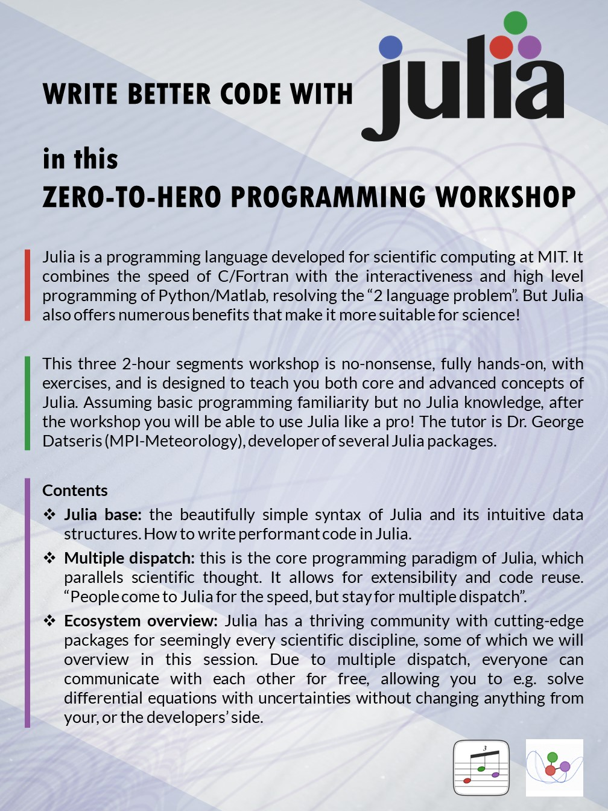

# Zero-to-Hero Julia workshop

**Table of Contents**
1. [Summary](#summary)
2. [Participating in this workshop](#participating-in-this-workshop)
   1. [Installing Julia: NOT covered](#installing-julia-not-covered)
   2. [Play around a bit!](#play-around-a-bit)
3. [What is Julia?](#what-is-julia)
4. [Why should I learn Julia?](#why-should-i-learn-julia)
5. [Credit](#credit)



## Summary

This is an intensive full-day workshop for the [Julia language](#what-is-julia), composed out of three 2-hour segments. It assumes only *rudimentary programming familiarity*. The goal of the workshop is to take you from zero to hero (regarding Julia): even if you know nothing about Julia, by the end you should be able to use it like a pro.


The material has been updated during July-August 2023 to Julia v1.9+ and corresponding latest stable versions of used packages.

This workshop is also available on YouTube: https://www.youtube.com/watch?v=Fi7Pf2NveH0 (in its original form)


## Participating in this workshop

### Installing Julia: NOT covered
Installing Julia and the environment you want to program in Julia is NOT part of this workshop! There are many options, up to preference, and may even depend on your operating system.

We recommend to install Julia using the most automated, prepackaged, and fool-proof way, which is as follows:

1. Install Julia via `juliaup`: https://github.com/JuliaLang/juliaup
2. Install VSCode as your programming environment: https://code.visualstudio.com/
3. Install the Julia for VSCode extension: Open VSCode, go to Extensions, search for `Julia` and install.

These steps are simple, work for "any" operating system, and out of the box you get:

1. A console for Julia which you can get by typing `Alt+J, Alt+O` in VSCode.
2. Using Julia in a scripting environment in VSCode. When working on a Julia script (`.jl` text file) you may evaluate any amount of code in the script interactively. E.g., `Ctrl+Enter` evaluates current line being edited. The Julia process that evaluates the script is the same as the one in the console you get in point 1. **The Julia console and the text editor window are linked!**
3. Jupyter notebooks, like the one you are reading now, which you can open from the command launch in VSCode (Ctrl+Shift+P) and then selecting "Jupyter: Import new notebook". Each Jupyter notebook launches a dedicated Julia process. **Jupyter notebooks are not linked with the standard text editor of VSCode!**

Additional Julia packages that may be used during the workshop can be installed on the spot, but if you want to pre-compile everything then simply run

```julia
import Pkg
Pkg.add(["BenchmarkTools", "CairoMakie", "OrdinaryDiffEq", "DynamicalSystems", "DrWatson", "DataFrames"])
```

### Play around a bit!

It is **strongly encouraged to have an active mindset during this tutorial**. Instead of only listening to my own boring voice, you should have a second Julia instance (e.g. REPL or a VSCode editor) and play around with the code and ideas I present. Ask questions during the tutorial, as there is a lot of time allocated for that!

## What is Julia?

[Julia](https://julialang.org/) is a relatively new programming language, developed at MIT, with version 1.0 released in August 2018. Even though it is so recent, it has taken the scientific community by storm and many serious large scale projects have started using Julia.

The [Julia documentation](https://docs.julialang.org/en/v1/) outlines the main facts and features of Julia.

## Why should I learn Julia?

*(in the author's personal opinion, which targets an audience of scientists)*

1. **It solves the two language problem**: it is a dynamic and interactive language that allows real time scientific exploration typically done in interpreted languages like Python, but still offers the performance of static low level languages such as C. Julia works by compiling machine level code and hence all basic programming concepts such as iteration, broadcasting, function-as-arguments, are fast by themselves. Hence, you would never have to "re-write" a code in Julia in another language to make it faster!
2. **Its syntax is intuitive and as close to math as possible**: The combination of high level syntax, Unicode, and simple to reason for code makes the code faster to write and read.
3. **Multiple dispatch**: is the core programming paradigm of Julia and is used with functional programming and in our opinion is the [most suitable paradigm to implement scientific thought in code](https://www.youtube.com/watch?v=7y-ahkUsIrY). Additionally, the power of multiple dispatch leads to [unprecedented code re-use](https://www.youtube.com/watch?v=kc9HwsxE1OY) that has never been seen in other programming languages. In short, packages can use and extend other packages very easily (most of the times for free!), without boiler-plate or glue code. See [this presentation](https://www.youtube.com/watch?v=2MBD10lqWp8) for an insane showcase of the power of the system, showing how a user gets **for free** trigonometric functions for real numbers, matrices, error propagation, symbolic dynamics, and automatic differentiation, all with the base `sin` function.
4. **Julia is written in Julia**: this has many advantages.
   * A typical user code isn't really different from Julia's very own base code, all the way down to basic arithmetic. This means, that understanding source code of other's packages, or even Julia's code itself, is straightforward. Hence, it is also straightforward to improve an existing codebase via a code contribution.
   * Most basic Julia types are used almost everywhere, and even if they aren't, due to multiple dispatch a front-end user wouldn't care. To give an example: a Python user would _have_ to use e.g., array types from PyTorch to implement performant advanced algorithms, especially for large datasets. However, if performant version of a function/operation a user needed, like e.g., the gamma function or some algorithm that operates on arrays, was not implemented for this "special" array type, that user is doomed. They will most likely not understand how a package like PyTorch implements numerics, to add their version of what they need. Instead, they will have to convert to "normal" python array, at a price of a slowdown in performance, and then going back again to the "fast" array versions. In Julia such things don't happen, because the "fast" array version is the "standard" array version, and even if not, all array types are anyways part of the same abstract interface due to multiple dispatch.
   * As a consequence, Python users are "forced" to find existing implementations of algorithms/functionalities in these Python packages like PyTorch/Numpy, and are "discouraged" from writing their own versions (writing a Runge-Kutta solver in Python was one of the biggest mistakes I've made!). Julia users instead could write their own low-level code, which improves their algorithmic/programming skills, gives them better understanding of how the algorithm works, and gives them more flexibility over it as well.
5. **Julia's package ecosystem is top-of-the-class in many scientific disciplines already**. Even though Julia is very new, and with a relatively small user base ([StackOverflow results](https://survey.stackoverflow.co/2022/#technology-most-popular-technologies) show Python usage at about 50%, Julia at about 2%), in many disciplines Julia's ecosystem is at least as good, and typically better, as Python's. I can only speak from experience, and from my perspective these ecosystems are about [nonlinear dynamics & complex systems](https://juliadynamics.github.io/JuliaDynamics/), [differential equations & scientific machine learning](https://sciml.ai/), [machine learning and auto differentiation](https://fluxml.ai/), [statistics](https://github.com/JuliaStats) (especially Distributions.jl and OnlineStats.jl), [interactive plotting](https://docs.makie.org/stable/) and even a [scientific project assistant software](https://github.com/JuliaDynamics/DrWatson.jl).
6. **Interoperability with other languages**: C is directly and natively callable from Julia. Python is callable from Julia with the same syntax as normal object-oriented Python code via [PythonCall.jl](https://github.com/cjdoris/PythonCall.jl). This means that you can **really use any Python package in Julia**, most of the time without even changing the syntax of the Python code. R, FORTRAN, etc., are callable similarly simply.
7. **Exceptionally strong integrated package manager**: Julia's package manager is just another package. It is flexible, strong, leading to less ambiguities versus other languages. On top of it, a strong binary shipping system is built. This all means that everything runs everywhere: no `makefile` nonsence, no spending weeks figuring out how to install things, no worries whether your program will be able to run on Windows. Everything is a 1-click install.


## Credit
Much of the material of this workshop is created by the author (George Datseris). However significant content comes from the following sources:

* The JuliaBox tutorials for the core language
* Exercises from exercism.io
* Chris Rackauckas' tutorials from http://ucidatascienceinitiative.github.io/IntroToJulia/
* Carsten Bauer's workshop https://github.com/crstnbr/JuliaWorkshop19
* Stefan Karpinski's JuliaCon talk, "The Unreasonable Effectiveness of Multiple Dispatch"
* Jonas Isensee's DrWatson talk at Julia users meetup (in UK, hosted by Invenia)
* https://github.com/mitmath/18330
* Kristoffer Carlsson and Fredrik Bagge Carlson's talk "Julia for AI and Data Science" https://www.youtube.com/watch?v=kc9HwsxE1OY